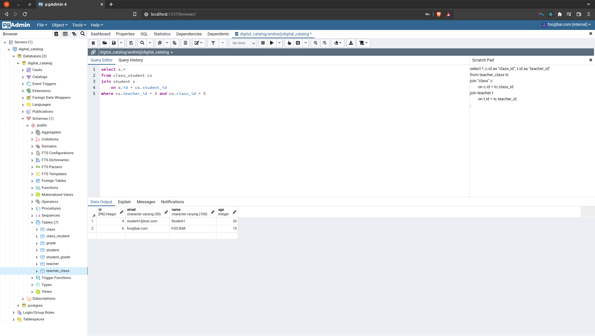

# Digital Catalog

The Notion page of this project can be found [here](https://hollow-soccer-dbb.notion.site/f6d54b71767b4b05bd88af7cefd9f9e7?v=35f72f45142d4402bffe7a343274c224).

## UML

<div style="text-align: center;">
    
</div>

---

## Setting up

Before running the Java App, make sure to spin up the Postgres container(along with a *pgAdmin* container):

```bash
# Optionally, `-d` can be used to start the containers in the background.
docker-compose up
```

---

## Visualizing the Database Schema with pgAdmin

After `docker-compose up` has been run:


* type in `localhost:1337` in the URL bar
* type in the **email** and **password**; they must correspond with the values from the `docker-compose.yml` file
* add a new connection(the defaults are `foo@bar` and `pass123`)
* for the **hostname**, use the **name of the container**; that can found with `docker ps`

    <div style="text-align: center;">
        
    </div>


* use `andrei` for the **username** and `pass123` for the **password**(these values can be found and modified in the `docker-compose.yml` file)

This is `pgadmin` in action:

<div style="text-align: center;">
    
</div>

---

## Using the App

*Note 1: a class is, in fact, made up of a `class_id` and a `teacher_id`*.

*Note 2: when updating, a field must be left blank(i.e. press `ENTER` directly) in order to use the default value*.

### A simple overview

<div style="text-align: center;">
    
</div>

### Adding a student to a class

First, a student must be created:

<div style="text-align: center;">
    
</div>

Then, it must be added to a certain class:

<div style="text-align: center;">
    
</div>

Finally, here is how the class looks like now:

<div style="text-align: center;">
    
</div>